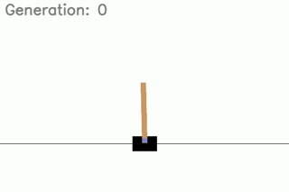

# PPO Reinforcement Learning in Gym Environments

## Overview
This project implements Proximal Policy Optimization (PPO) for both continuous and discrete action spaces using OpenAI Gym environments. The core components include:
- **PPO Networks**: Separate architectures for continuous and discrete environments.
- **PPO Algorithm**: A class-based implementation supporting both action types.
- **Hyperparameter Tuner**: Automates tuning for optimal performance.
- **Video Generator**: Creates visualizations of trained policies.

## Implemented Environments
### CartPole (Discrete)
A simple balancing task where a pole is attached to a cart, and the goal is to keep it upright by applying forces to the cart.

  
Show Tuning Graphs

  
  

### LunarLander (Discrete)
A lunar lander must be controlled to safely reach the landing pad with minimal fuel consumption.

  
Show Tuning Graphs

  
  

## Common Components
### PPO Network
- Discrete and continuous variations.

### PPO Algorithm
- Policy updates via clipped objective.
- Generalized Advantage Estimation (GAE).
- Rolling window normalization to keep reward relevant.

### Hyperparameter Tuner
- Automates search for learning rate, batch size, etc. This is done though a naive search and it saves the results of each set of hyperparamters for efficient searching.

### Video Generator
- Saves rollout episodes for analysis.
